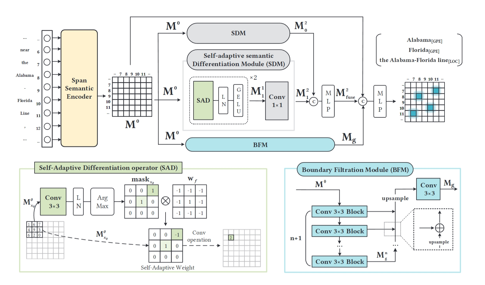

# DiFiNet: Boundary-Aware Semantic Differentiation and Filtration Network for Nested Named Entity Recognition

## Overview

This is the code for [DiFiNet: Boundary-Aware Semantic Differentiation and Filtration Network for Nested Named Entity Recognition](https://openreview.net/forum?id=zAig3Mmy1v), accepted by ACL 2024.



## Requirements

```
GPU=NVIDIA A100 Tensor Core
beautifulsoup4==4.9.3
FastNLP==1.0.1
fitlog==0.9.15
nltk==3.8.1
numpy==1.24.4
pandas==1.1.3
sparse==0.14.0
torch==1.13.1+cu117
torch_scatter==2.0.9
tqdm==4.65.0
transformers==4.20.1
```

## Preprocess your datasets
Put ACE datasets in the `preprocess/data` directory, following a similar structure as demonstrated in [CNN_Nested_NER](https://github.com/yhcc/CNN_Nested_NER) 

For GENIA dataset, we use the version from [W2NER](https://github.com/ljynlp/W2NER)

## Train

   ```
   bash train_arg_{dataset}.sh
   ```
The item {dataset} can be replaced with "04", "05" or "genia". The experiment results can be found in the directory `logs` after initiating the training process.


## Citation
```
@inproceedings{cai-etal-2024-difinet,
    title = "{D}i{F}i{N}et: Boundary-Aware Semantic Differentiation and Filtration Network for Nested Named Entity Recognition",
    author = "Cai, Yuxiang  and
      Liu, Qiao  and
      Gan, Yanglei  and
      Lin, Run  and
      Li, Changlin  and
      Liu, Xueyi  and
      Luo, Da  and
      Jiaye, Yang",
    editor = "Ku, Lun-Wei  and
      Martins, Andre  and
      Srikumar, Vivek",
    booktitle = "Proceedings of the 62nd Annual Meeting of the Association for Computational Linguistics (Volume 1: Long Papers)",
    month = aug,
    year = "2024",
    address = "Bangkok, Thailand",
    publisher = "Association for Computational Linguistics",
    url = "https://aclanthology.org/2024.acl-long.349",
    pages = "6455--6471"
}
```
## Have any Questions？Please email cyx_yyy at foxmail dot com


## Acknowledge
The code of [CNN_Nested_NER](https://github.com/yhcc/CNN_Nested_NER)
